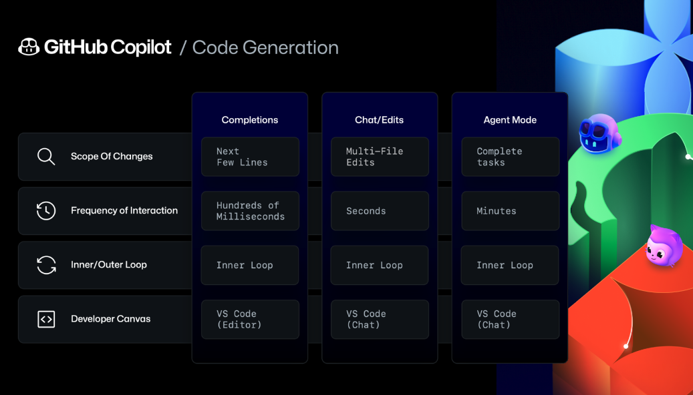

| Modo   | O que faz                                                                                              | Quando usar                                                                                          | Controle do usuário                   | Escopo de ação                            |
|--------|--------------------------------------------------------------------------------------------------------|------------------------------------------------------------------------------------------------------|----------------------------------------|-------------------------------------------|
| **Ask**   | Responde perguntas sobre código, explicações ou exemplos, sem alterar arquivos .      | Quando você quer clareza, ajuda rápida ou entendimento, mas sem modificar o projeto.               | 100% do usuário; somente leitura       | Contexto imediato selecionado            |
| **Edit**  | Aplica mudanças baseadas em instruções (ex: refatoração, tratamento de erros), revisão antes do commit . | Ideal para aplicar melhorias cirúrgicas em blocos de código específicos, com revisão antes de salvar. | Controle total – vê diffs antes de aplicar | Conjunto de arquivos definido pelo usuário |
| **Agent** | Executa alterações complexas: planeja, edita múltiplos arquivos, executa comandos e corrige erros automaticamente    | Para tarefas multi-etapa, automação de features, migrações ou prototipagem com intervenção mínima.  | Confirmação de comandos (ex: terminal), mas age de forma autônoma | Projeto todo, incluindo ferramentas externas (via MCP) |

##  Copilot Ask – "Só quero entender ou aprender algo"

| Exemplo                                 | Descrição                                                                 |
|-----------------------------------------|---------------------------------------------------------------------------|
| `// Por que essa função está lenta?`    | O Copilot explica gargalos de performance no código.                     |
| `// Como fazer debounce em JavaScript?` | Responde com uma explicação e exemplo de implementação.                  |
| `// Qual a diferença entre map() e forEach()?` | Traz uma explicação conceitual com exemplos comparativos.         |
| `// O que essa regex faz?`              | Analisa a expressão regular e traduz em linguagem natural.               |

> Ideal para: dúvidas conceituais, aprendizado, revisão rápida sem mudar nada.

---

##  Copilot Edit – "Quero modificar algo que já estou vendo"

| Exemplo                                 | Descrição                                                                 |
|-----------------------------------------|---------------------------------------------------------------------------|
| `// Adicione tratamento de erro a essa função` | Adiciona `try/catch` ou validações seguras ao código.             |
| `// Melhore a legibilidade dessa função` | Refatora variáveis, nomes e estrutura mantendo a lógica.           |
| `// Converta para async/await`          | Reescreve chamadas `then/catch` em formato assíncrono moderno.           |
| `// Adicione tipagem TypeScript`        | Adiciona tipos explícitos com base no uso da função.                     |

> Ideal para: mudanças pontuais em blocos de código, revisão com controle antes de aplicar.

---

##  Copilot Agent – "Quero que resolva algo por inteiro pra mim"

| Exemplo                                           | Descrição                                                                                  |
|---------------------------------------------------|--------------------------------------------------------------------------------------------|
| `Crie uma API REST para cadastrar produtos`       | Cria arquivos, estrutura de pastas, configurações, rotas e handlers.                      |
| `Adicione autenticação JWT na minha aplicação`    | Detecta framework, adiciona middleware, rotas de login/registro, validações, etc.         |
| `Refatore o projeto para usar React Router v6`    | Atualiza rotas, navegação e adapta o código à nova versão.                                |
| `Corrija o erro que aparece quando eu rodo npm test` | Identifica, interpreta logs e aplica correções nos arquivos necessários.              |

> Ideal para: tarefas multi-arquivo, automação de features, prototipação e troubleshooting com baixa intervenção.

---

